# Capstone 1: Kickstarter Projects
I chose to do my exploratory data analysis on a collection of nearly 400,000 Kickstarter projects. Columns included project start/completion date, status, goal, and backer and pledge counts. This dataset was fortunately quite clean already with only a small handful of snags. 
    
## Exploratory Data Analysis
### First Pass

While the data was generally applicable, I noticed that a few columns seemed redundant. The 'USD_' categories were presumably meant to convert currencies into a singular format for easier tabulation. However, a quick inspection revealed that currencies were already overwhelmingly USD anyway. 

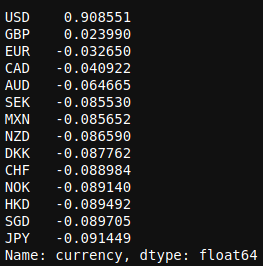

    
Similarly, when I looked into Kickstarter's policies, pledges are always collected in the project's native currency. I double-checked this by trying to identify any rows with a currency that didn't match its country (e.g. USD:US, GBP:GB). This means we can infer where projects originated by their currency used. 

Given the proportion of USD projects, the outdated conversion rates, and that USD covered both extremes (min/max) I elected to leave out the converted values and work with the raw amounts. 

Next, I saw that the 'length' column I calculated using 'launched' and 'pledged' had some incredibly large values! For whatever reason, a handful of projects had a launch date of 1970-01-01. I decided the safest choice was to change these to Kickstarter's official launch date of 2009-04-28.

### Making Numbers Look Good!

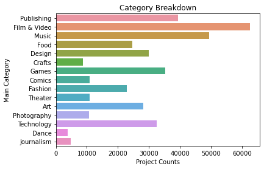

Moving into the bulk of the data, the Seaborn library had some readily available tools for representing categorical data -- namely, it gave easily digestible breakdowns of the sub-categories, e.g. genres in Film & Video, by color-coding them. 

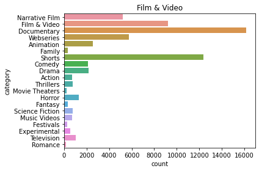

If interested, breakdowns for the sub-categories are stored in the [images folder](images/subcategories) to save space. 

### How The Pieces Fit
The most obvious question I felt to ask was 'how successful are Kickstarter projects in general?'

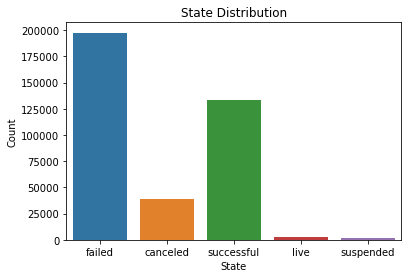

Seems convincing enough that the successful projects aren't the norm. Being a crowdfunding site, projects hinge on getting a little support from a lot of people. While it is self-explanatory that projects without *any* backers would be failed or cancelled, the concentration of small goal amounts, backer counts, and pledges against the extreme outliers made the scale difficult to present. For that reason, I used Seaborn's pointplot to estimate the expected amounts of backers to a project's success.

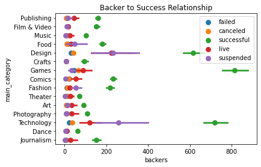

In the above graph, we can easily tell that successful projects in Design, Games, and Technology had particularly high concentrations of backers. This prompted me to ask: what did the success breakdowns look like for these three categories?

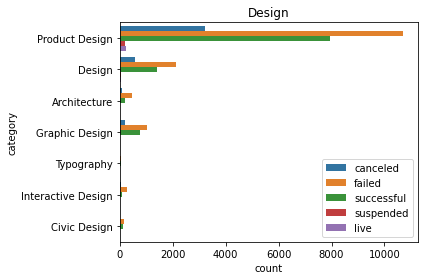
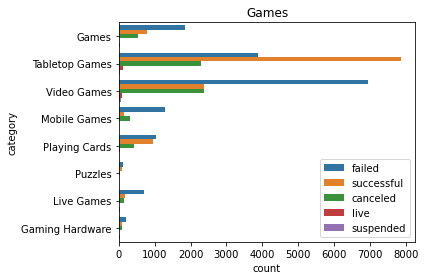
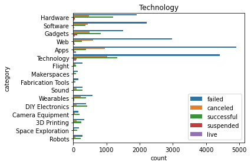

The most apparent and curious part of these graphs is that, while the relation of backers to success in a category follows the expected trend of indicating success, it can be misleading. The Technology category (and Games, to a lesser extent) was hiding a staggering number of failed projects. 

After narrowing down which categories had some interesting dimensions, I looked at the goals in the subcategories to see if any interesting trends cropped up. 

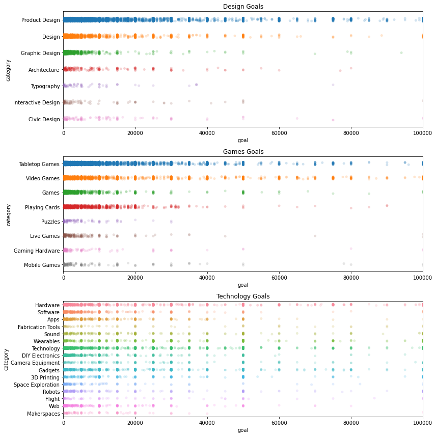
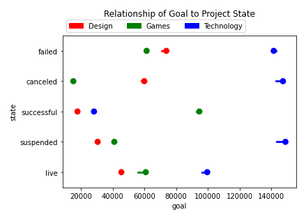

Unsurprisingly, the overwhelming majority of these projects had goals at nice, round figures. The culprits for our earlier observations regarding high success in these categories came from projects that were themselves outliers; I've scaled this graph down, but there are points reaching the millions range here!
        
## Hypothesis Tests

For my hypothesis test, I posited that 

    There is no difference in pledge amounts of categories of different sizes.

Because I had so many projects in the dataset, I created my sample sets by choosing 10,000 pledges each with replacement from the largest category (Film & Video) and the smallest category (Dance). This helped me better evaluate centrality in the pledges with less distortion from the extreme outliers. I wanted to be quite certain that seeing a difference in pledge amounts were convincing, so I chose an alpha of .02. I then used the ScipyStats t-test to evaluate how different the pledge amounts were in the two categories.

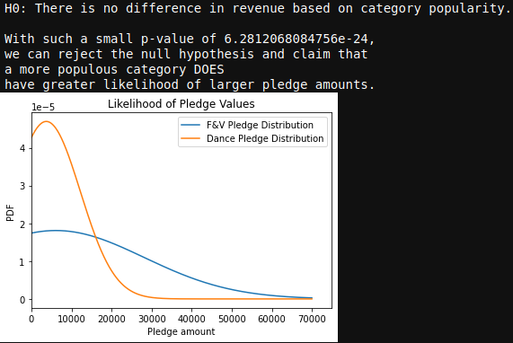

The graph and test result give a clear indication that a crowdfunding project works how one might expect: a great number of small amounts. However, the pvalue tells us that there is a substantial difference in the pledge amounts between the projects, so we can say that a more popular category tend to have different (greater) pledge amounts.

## Future Ideas
* Observe relationship of pledges through lifetime of a project
* Where do the pledges come from? 
* How to handle the project 'states' better -- weighting 'canceled' vs. 'failed' vs. 'suspended'
* I opted not to work with converted data points; is there something meaningful buried in the data of pledges from non-domestic sources?
